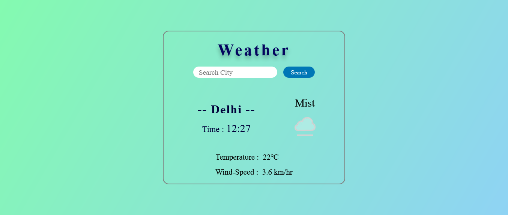
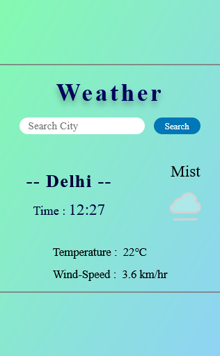

# Weather-App

## Table of contents

- [Overview](#overview)
  - [The challenge](#the-challenge)
  - [Screenshot](#screenshot)
  - [Links](#links)
- [My process](#my-process)
  - [Built with](#built-with)

## Overview

### The challenge

Users should be able to:

- View the optimal layout for the site depending on their device's screen size
- See hover states for all interactive elements on the page

### Screenshot

1) 
2) 

### Links

- Live Site URL: [Live site URL](https://raza7522.github.io/Weather-App/)

## My process

### Built with

- Semantic HTML5 markup
- Flexbox
- API
- Desktop-first workflow